# ROAR Protocol — Visual Architecture

> Interactive Mermaid diagrams for understanding the ROAR protocol stack.
> Render these in any Mermaid-compatible viewer (GitHub, VS Code, Obsidian, etc.)

---

## Table of Contents

1. [Five-Layer Architecture](#1-five-layer-architecture)
2. [Message Flow — Delegation Chain](#2-message-flow--delegation-chain)
3. [Message Signing & Verification](#3-message-signing--verification)
4. [The 7 Intents](#4-the-7-intents)
5. [Discovery & Hub Interaction](#5-discovery--hub-interaction)
6. [Hub Federation](#6-hub-federation)
7. [Delegation & Graduated Autonomy](#7-delegation--graduated-autonomy)
8. [Transport Negotiation](#8-transport-negotiation)
9. [Stream Event Flow](#9-stream-event-flow)
10. [DNS-Based Discovery](#10-dns-based-discovery)
11. [Protocol Adapter Bridge](#11-protocol-adapter-bridge)
12. [Connection Lifecycle](#12-connection-lifecycle)

---

## 1. Five-Layer Architecture

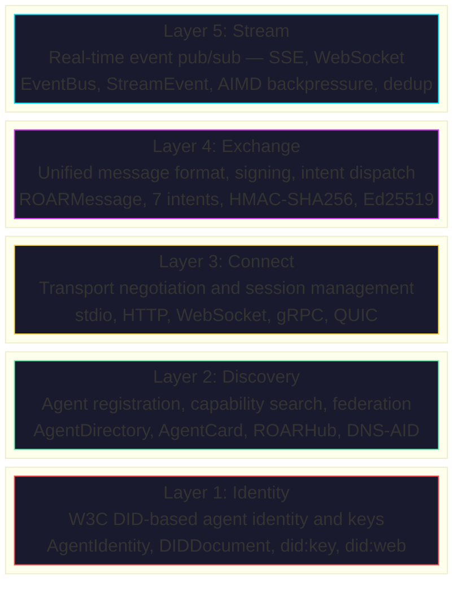
```mermaid
block-beta
  columns 1
  block:layer5:1
    L5["Layer 5: Stream\nReal-time event pub/sub — SSE, WebSocket\nEventBus, StreamEvent, AIMD backpressure, dedup"]
  end
  block:layer4:1
    L4["Layer 4: Exchange\nUnified message format, signing, intent dispatch\nROARMessage, 7 intents, HMAC-SHA256, Ed25519"]
  end
  block:layer3:1
    L3["Layer 3: Connect\nTransport negotiation and session management\nstdio, HTTP, WebSocket, gRPC, QUIC"]
  end
  block:layer2:1
    L2["Layer 2: Discovery\nAgent registration, capability search, federation\nAgentDirectory, AgentCard, ROARHub, DNS-AID"]
  end
  block:layer1:1
    L1["Layer 1: Identity\nW3C DID-based agent identity and keys\nAgentIdentity, DIDDocument, did:key, did:web"]
  end

  style L5 fill:#1a1a2e,stroke:#00E5FF,color:#00E5FF
  style L4 fill:#1a1a2e,stroke:#E040FB,color:#E040FB
  style L3 fill:#1a1a2e,stroke:#FFD740,color:#FFD740
  style L2 fill:#1a1a2e,stroke:#69F0AE,color:#69F0AE
  style L1 fill:#1a1a2e,stroke:#FF5252,color:#FF5252
```

### Layered architecture (flowchart version)

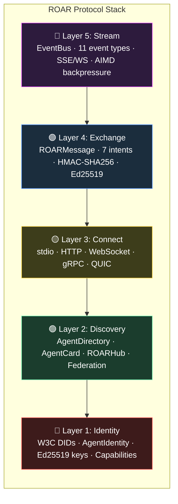
```mermaid
graph TB
  subgraph "ROAR Protocol Stack"
    direction TB
    S["🔴 Layer 5: Stream<br/>EventBus · 11 event types · SSE/WS · AIMD backpressure"]
    E["🟣 Layer 4: Exchange<br/>ROARMessage · 7 intents · HMAC-SHA256 · Ed25519"]
    C["🟡 Layer 3: Connect<br/>stdio · HTTP · WebSocket · gRPC · QUIC"]
    D["🟢 Layer 2: Discovery<br/>AgentDirectory · AgentCard · ROARHub · Federation"]
    I["🔵 Layer 1: Identity<br/>W3C DIDs · AgentIdentity · Ed25519 keys · Capabilities"]
  end

  S --> E
  E --> C
  C --> D
  D --> I

  style S fill:#2d1b3d,stroke:#E040FB,color:#fff
  style E fill:#1b2d3d,stroke:#448AFF,color:#fff
  style C fill:#3d3d1b,stroke:#FFD740,color:#fff
  style D fill:#1b3d2d,stroke:#69F0AE,color:#fff
  style I fill:#3d1b1b,stroke:#FF5252,color:#fff
```

---

## 2. Message Flow — Delegation Chain

A real-world scenario: an IDE delegates work through agents to a tool.

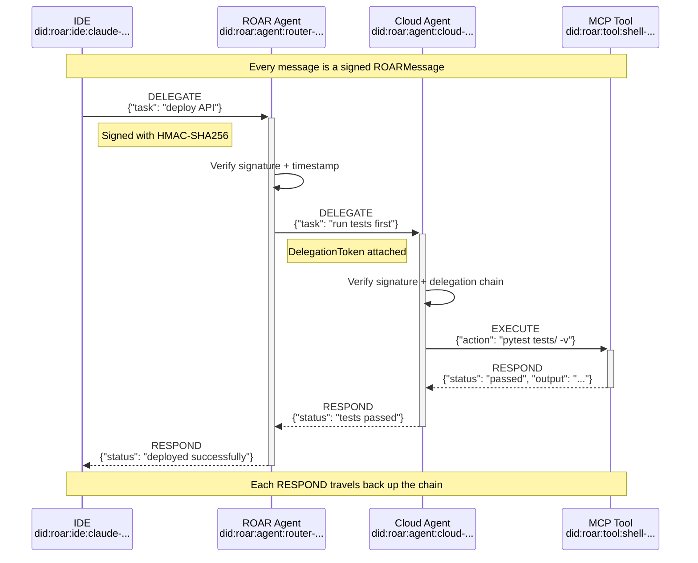
```mermaid
sequenceDiagram
  participant IDE as IDE<br/>did:roar:ide:claude-...
  participant PB as ROAR Agent<br/>did:roar:agent:router-...
  participant Cloud as Cloud Agent<br/>did:roar:agent:cloud-...
  participant Tool as MCP Tool<br/>did:roar:tool:shell-...

  Note over IDE,Tool: Every message is a signed ROARMessage

  IDE->>+PB: DELEGATE<br/>{"task": "deploy API"}
  Note right of IDE: Signed with HMAC-SHA256

  PB->>PB: Verify signature + timestamp
  PB->>+Cloud: DELEGATE<br/>{"task": "run tests first"}
  Note right of PB: DelegationToken attached

  Cloud->>Cloud: Verify signature + delegation chain
  Cloud->>+Tool: EXECUTE<br/>{"action": "pytest tests/ -v"}

  Tool-->>-Cloud: RESPOND<br/>{"status": "passed", "output": "..."}
  Cloud-->>-PB: RESPOND<br/>{"status": "tests passed"}
  PB-->>-IDE: RESPOND<br/>{"status": "deployed successfully"}

  Note over IDE,Tool: Each RESPOND travels back up the chain
```

---

## 3. Message Signing & Verification

```mermaid
flowchart LR
  subgraph Sender["Sender (Agent A)"]
    direction TB
    M["Construct ROARMessage"]
    CB["Build canonical JSON body<br/>(id, from.did, to.did, intent,<br/>payload, context, timestamp)<br/>sort_keys=True"]
    SG["HMAC-SHA256(secret, canonical)"]
    AT["Set auth.signature =<br/>'hmac-sha256:&lt;hex&gt;'"]
    TX["Transmit message"]

    M --> CB --> SG --> AT --> TX
  end

  subgraph Receiver["Receiver (Agent B)"]
    direction TB
    RX["Receive message"]
    TS["Check timestamp<br/>within 5-min window"]
    DP["Check message ID<br/>not in replay cache"]
    RB["Rebuild canonical body<br/>from received fields"]
    VF["HMAC-SHA256(secret, body)<br/>== received signature?"]
    OK["Dispatch to<br/>intent handler"]
    RJ["REJECT"]

    RX --> TS
    TS -->|valid| DP
    TS -->|expired| RJ
    DP -->|unique| RB
    DP -->|duplicate| RJ
    RB --> VF
    VF -->|match| OK
    VF -->|mismatch| RJ
  end

  TX --> RX

  style SG fill:#1b3d1b,stroke:#69F0AE,color:#fff
  style VF fill:#1b3d1b,stroke:#69F0AE,color:#fff
  style RJ fill:#3d1b1b,stroke:#FF5252,color:#fff
  style OK fill:#1b2d3d,stroke:#448AFF,color:#fff
```

### Ed25519 Signing (Cross-Organization)

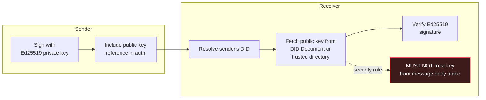
```mermaid
flowchart LR
  subgraph Sender["Sender"]
    A1["Sign with<br/>Ed25519 private key"]
    A2["Include public key<br/>reference in auth"]
  end

  subgraph Receiver["Receiver"]
    B1["Resolve sender's DID"]
    B2["Fetch public key from<br/>DID Document or<br/>trusted directory"]
    B3["Verify Ed25519<br/>signature"]
    B4["MUST NOT trust key<br/>from message body alone"]
  end

  A1 --> A2 --> B1 --> B2 --> B3
  B2 -.->|"security rule"| B4

  style B4 fill:#3d1b1b,stroke:#FF5252,color:#fff
```

---

## 4. The 7 Intents

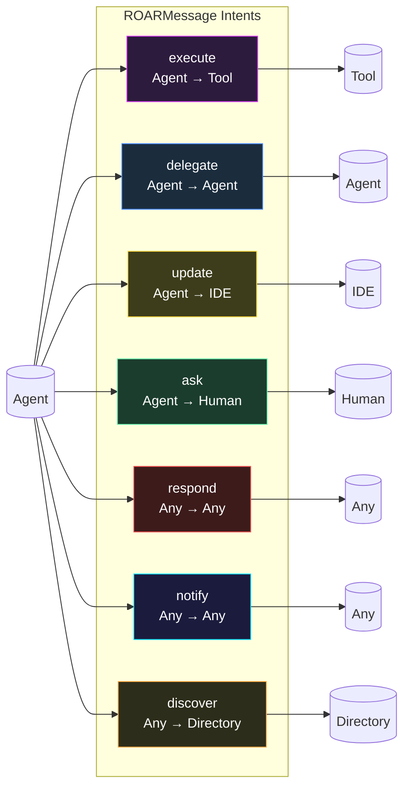
```mermaid
graph LR
  subgraph Intents["ROARMessage Intents"]
    direction TB
    EX["execute<br/>Agent → Tool"]
    DL["delegate<br/>Agent → Agent"]
    UP["update<br/>Agent → IDE"]
    AK["ask<br/>Agent → Human"]
    RS["respond<br/>Any → Any"]
    NT["notify<br/>Any → Any"]
    DS["discover<br/>Any → Directory"]
  end

  AG[("Agent")] --> EX --> TL[("Tool")]
  AG --> DL --> AG2[("Agent")]
  AG --> UP --> ID[("IDE")]
  AG --> AK --> HU[("Human")]
  AG --> RS --> ANY[("Any")]
  AG --> NT --> ANY2[("Any")]
  AG --> DS --> DIR[("Directory")]

  style EX fill:#2d1b3d,stroke:#E040FB,color:#fff
  style DL fill:#1b2d3d,stroke:#448AFF,color:#fff
  style UP fill:#3d3d1b,stroke:#FFD740,color:#fff
  style AK fill:#1b3d2d,stroke:#69F0AE,color:#fff
  style RS fill:#3d1b1b,stroke:#FF5252,color:#fff
  style NT fill:#1b1b3d,stroke:#00E5FF,color:#fff
  style DS fill:#2d2d1b,stroke:#FFAB40,color:#fff
```

---

## 5. Discovery & Hub Interaction

### Agent Registration & Discovery

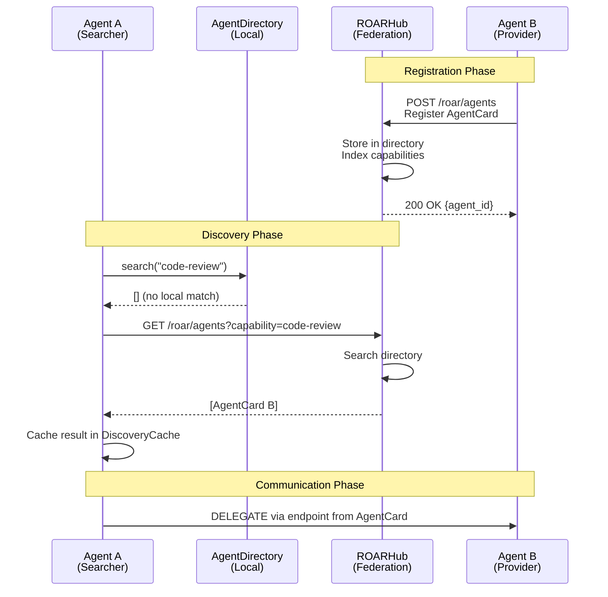
```mermaid
sequenceDiagram
  participant A as Agent A<br/>(Searcher)
  participant Dir as AgentDirectory<br/>(Local)
  participant Hub as ROARHub<br/>(Federation)
  participant B as Agent B<br/>(Provider)

  Note over B,Hub: Registration Phase

  B->>Hub: POST /roar/agents<br/>Register AgentCard
  Hub->>Hub: Store in directory<br/>Index capabilities
  Hub-->>B: 200 OK {agent_id}

  Note over A,Hub: Discovery Phase

  A->>Dir: search("code-review")
  Dir-->>A: [] (no local match)
  A->>Hub: GET /roar/agents?capability=code-review
  Hub->>Hub: Search directory
  Hub-->>A: [AgentCard B]
  A->>A: Cache result in DiscoveryCache

  Note over A,B: Communication Phase

  A->>B: DELEGATE via endpoint from AgentCard
```

### Three-Tier Discovery

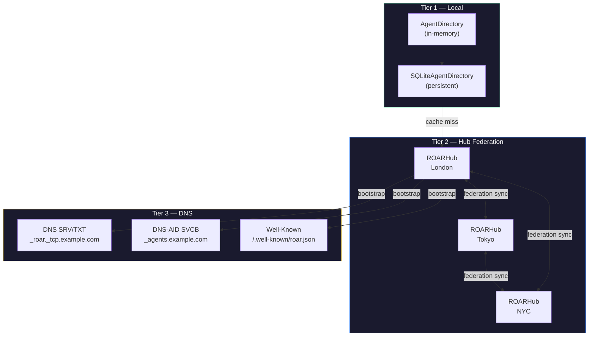
```mermaid
graph TB
  subgraph Tier1["Tier 1 — Local"]
    LD["AgentDirectory<br/>(in-memory)"]
    SQ["SQLiteAgentDirectory<br/>(persistent)"]
  end

  subgraph Tier2["Tier 2 — Hub Federation"]
    H1["ROARHub<br/>London"]
    H2["ROARHub<br/>Tokyo"]
    H3["ROARHub<br/>NYC"]
  end

  subgraph Tier3["Tier 3 — DNS"]
    DNS["DNS SRV/TXT<br/>_roar._tcp.example.com"]
    AID["DNS-AID SVCB<br/>_agents.example.com"]
    WK["Well-Known<br/>/.well-known/roar.json"]
  end

  LD --> SQ
  SQ -->|"cache miss"| H1
  H1 <-->|"federation sync"| H2
  H2 <-->|"federation sync"| H3
  H1 <-->|"federation sync"| H3
  H1 -->|"bootstrap"| DNS
  H1 -->|"bootstrap"| AID
  H1 -->|"bootstrap"| WK

  style Tier1 fill:#1a1a2e,stroke:#69F0AE,color:#fff
  style Tier2 fill:#1a1a2e,stroke:#448AFF,color:#fff
  style Tier3 fill:#1a1a2e,stroke:#FFD740,color:#fff
```

---

## 6. Hub Federation

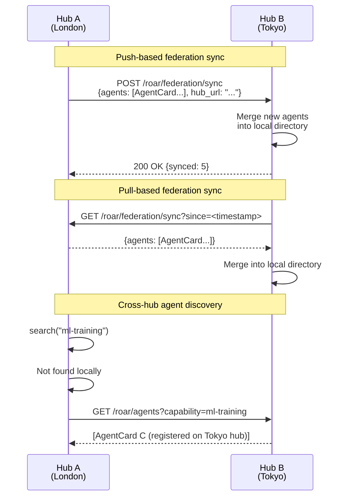
```mermaid
sequenceDiagram
  participant H1 as Hub A<br/>(London)
  participant H2 as Hub B<br/>(Tokyo)

  Note over H1,H2: Push-based federation sync

  H1->>H2: POST /roar/federation/sync<br/>{agents: [AgentCard...], hub_url: "..."}
  H2->>H2: Merge new agents<br/>into local directory
  H2-->>H1: 200 OK {synced: 5}

  Note over H1,H2: Pull-based federation sync

  H2->>H1: GET /roar/federation/sync?since=<timestamp>
  H1-->>H2: {agents: [AgentCard...]}
  H2->>H2: Merge into local directory

  Note over H1,H2: Cross-hub agent discovery

  H1->>H1: search("ml-training")
  H1->>H1: Not found locally
  H1->>H2: GET /roar/agents?capability=ml-training
  H2-->>H1: [AgentCard C (registered on Tokyo hub)]
```

---

## 7. Delegation & Graduated Autonomy

### Autonomy Levels

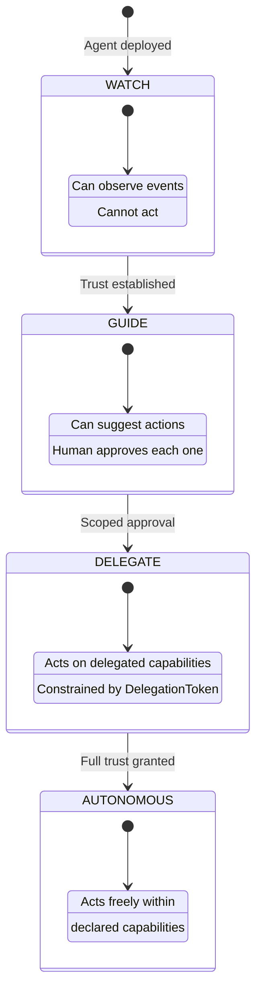
```mermaid
stateDiagram-v2
  [*] --> WATCH: Agent deployed
  WATCH --> GUIDE: Trust established
  GUIDE --> DELEGATE: Scoped approval
  DELEGATE --> AUTONOMOUS: Full trust granted

  state WATCH {
    [*] --> Observe
    Observe: Can observe events
    Observe: Cannot act
  }

  state GUIDE {
    [*] --> Suggest
    Suggest: Can suggest actions
    Suggest: Human approves each one
  }

  state DELEGATE {
    [*] --> Act
    Act: Acts on delegated capabilities
    Act: Constrained by DelegationToken
  }

  state AUTONOMOUS {
    [*] --> Free
    Free: Acts freely within
    Free: declared capabilities
  }
```

### Delegation Token Flow

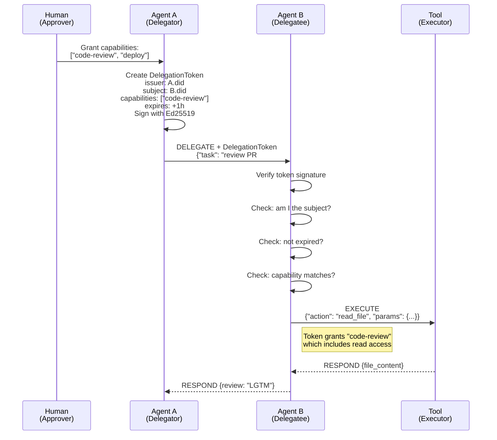
```mermaid
sequenceDiagram
  participant H as Human<br/>(Approver)
  participant A as Agent A<br/>(Delegator)
  participant B as Agent B<br/>(Delegatee)
  participant T as Tool<br/>(Executor)

  H->>A: Grant capabilities:<br/>["code-review", "deploy"]

  A->>A: Create DelegationToken<br/>issuer: A.did<br/>subject: B.did<br/>capabilities: ["code-review"]<br/>expires: +1h<br/>Sign with Ed25519

  A->>B: DELEGATE + DelegationToken<br/>{"task": "review PR #42"}

  B->>B: Verify token signature
  B->>B: Check: am I the subject?
  B->>B: Check: not expired?
  B->>B: Check: capability matches?

  B->>T: EXECUTE<br/>{"action": "read_file", "params": {...}}
  Note right of B: Token grants "code-review"<br/>which includes read access

  T-->>B: RESPOND {file_content}
  B-->>A: RESPOND {review: "LGTM"}
```

---

## 8. Transport Negotiation

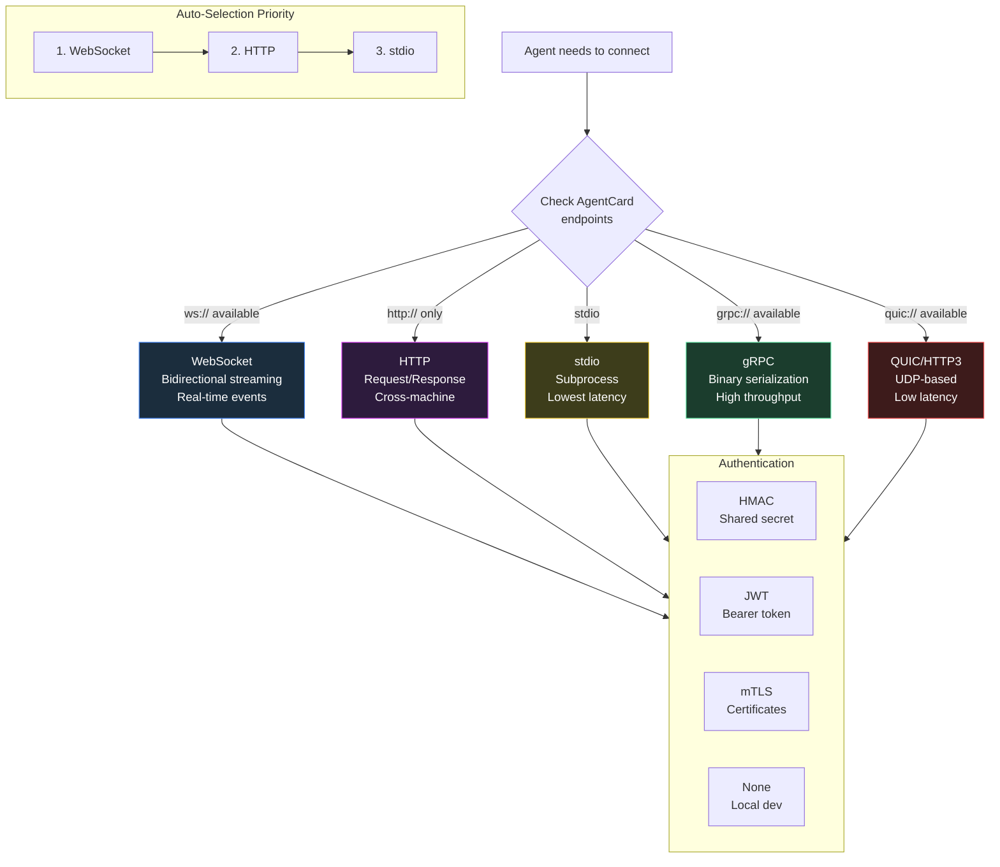
```mermaid
flowchart TD
  Start["Agent needs to connect"] --> Check{"Check AgentCard<br/>endpoints"}

  Check -->|"ws:// available"| WS["WebSocket<br/>Bidirectional streaming<br/>Real-time events"]
  Check -->|"http:// only"| HTTP["HTTP<br/>Request/Response<br/>Cross-machine"]
  Check -->|"stdio"| STDIO["stdio<br/>Subprocess<br/>Lowest latency"]
  Check -->|"grpc:// available"| GRPC["gRPC<br/>Binary serialization<br/>High throughput"]
  Check -->|"quic:// available"| QUIC["QUIC/HTTP3<br/>UDP-based<br/>Low latency"]

  subgraph Priority["Auto-Selection Priority"]
    direction LR
    P1["1. WebSocket"] --> P2["2. HTTP"] --> P3["3. stdio"]
  end

  subgraph Auth["Authentication"]
    direction LR
    HMAC["HMAC<br/>Shared secret"]
    JWT["JWT<br/>Bearer token"]
    MTLS["mTLS<br/>Certificates"]
    NONE["None<br/>Local dev"]
  end

  WS --> Auth
  HTTP --> Auth
  STDIO --> Auth
  GRPC --> Auth
  QUIC --> Auth

  style WS fill:#1b2d3d,stroke:#448AFF,color:#fff
  style HTTP fill:#2d1b3d,stroke:#E040FB,color:#fff
  style STDIO fill:#3d3d1b,stroke:#FFD740,color:#fff
  style GRPC fill:#1b3d2d,stroke:#69F0AE,color:#fff
  style QUIC fill:#3d1b1b,stroke:#FF5252,color:#fff
```

---

## 9. Stream Event Flow

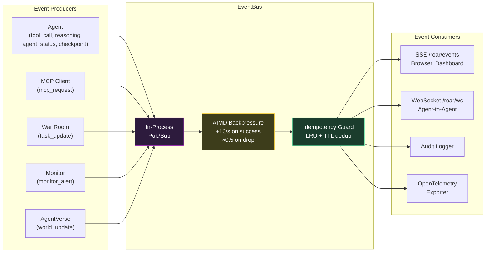
```mermaid
flowchart LR
  subgraph Producers["Event Producers"]
    AG["Agent<br/>(tool_call, reasoning,<br/>agent_status, checkpoint)"]
    MCP["MCP Client<br/>(mcp_request)"]
    WR["War Room<br/>(task_update)"]
    MON["Monitor<br/>(monitor_alert)"]
    AV["AgentVerse<br/>(world_update)"]
  end

  subgraph Bus["EventBus"]
    EB["In-Process<br/>Pub/Sub"]
    BP["AIMD Backpressure<br/>+10/s on success<br/>×0.5 on drop"]
    IG["Idempotency Guard<br/>LRU + TTL dedup"]
  end

  subgraph Consumers["Event Consumers"]
    SSE["SSE /roar/events<br/>Browser, Dashboard"]
    WSC["WebSocket /roar/ws<br/>Agent-to-Agent"]
    LOG["Audit Logger"]
    OTEL["OpenTelemetry<br/>Exporter"]
  end

  AG --> EB
  MCP --> EB
  WR --> EB
  MON --> EB
  AV --> EB

  EB --> BP --> IG

  IG --> SSE
  IG --> WSC
  IG --> LOG
  IG --> OTEL

  style EB fill:#2d1b3d,stroke:#E040FB,color:#fff
  style BP fill:#3d3d1b,stroke:#FFD740,color:#fff
  style IG fill:#1b3d2d,stroke:#69F0AE,color:#fff
```

### Stream Event Types

```mermaid
graph TB
  SE["StreamEvent<br/>(11 types)"]

  SE --> TC["tool_call<br/>Track tool invocations"]
  SE --> MR["mcp_request<br/>Monitor MCP requests"]
  SE --> RS["reasoning<br/>Agent thinking traces"]
  SE --> TU["task_update<br/>Mission board changes"]
  SE --> MA["monitor_alert<br/>Web/API notifications"]
  SE --> AS["agent_status<br/>idle / busy / offline"]
  SE --> CP["checkpoint<br/>Crash recovery snapshots"]
  SE --> WU["world_update<br/>Virtual world state"]
  SE --> SS["stream_start<br/>Stream lifecycle begin"]
  SE --> SN["stream_end<br/>Stream lifecycle end"]
  SE --> AD["agent_delegate<br/>Delegation events"]

  style SE fill:#1a1a2e,stroke:#00E5FF,color:#00E5FF
  style TC fill:#2d1b3d,stroke:#E040FB,color:#fff
  style MR fill:#1b2d3d,stroke:#448AFF,color:#fff
  style RS fill:#3d3d1b,stroke:#FFD740,color:#fff
  style TU fill:#1b3d2d,stroke:#69F0AE,color:#fff
  style MA fill:#3d1b1b,stroke:#FF5252,color:#fff
  style AS fill:#1b1b3d,stroke:#00E5FF,color:#fff
  style CP fill:#2d2d1b,stroke:#FFAB40,color:#fff
  style WU fill:#3d2d1b,stroke:#FF6E40,color:#fff
  style SS fill:#1b3d3d,stroke:#18FFFF,color:#fff
  style SN fill:#3d1b2d,stroke:#F48FB1,color:#fff
  style AD fill:#2d3d1b,stroke:#C6FF00,color:#fff
```

---

## 10. DNS-Based Discovery

> **Status: Experimental** — Implements the IETF BANDAID concept for agent discovery via DNS.

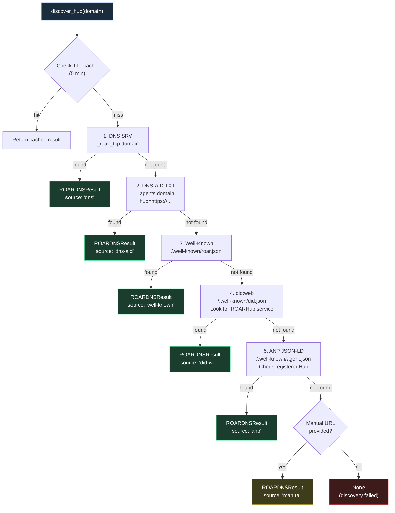
```mermaid
flowchart TB
  Start["discover_hub(domain)"] --> Cache{"Check TTL cache<br/>(5 min)"}

  Cache -->|"hit"| Return["Return cached result"]
  Cache -->|"miss"| S1

  S1["1. DNS SRV<br/>_roar._tcp.domain"] -->|"found"| Done["ROARDNSResult<br/>source: 'dns'"]
  S1 -->|"not found"| S2

  S2["2. DNS-AID TXT<br/>_agents.domain<br/>hub=https://..."] -->|"found"| Done2["ROARDNSResult<br/>source: 'dns-aid'"]
  S2 -->|"not found"| S3

  S3["3. Well-Known<br/>/.well-known/roar.json"] -->|"found"| Done3["ROARDNSResult<br/>source: 'well-known'"]
  S3 -->|"not found"| S4

  S4["4. did:web<br/>/.well-known/did.json<br/>Look for ROARHub service"] -->|"found"| Done4["ROARDNSResult<br/>source: 'did-web'"]
  S4 -->|"not found"| S5

  S5["5. ANP JSON-LD<br/>/.well-known/agent.json<br/>Check registeredHub"] -->|"found"| Done5["ROARDNSResult<br/>source: 'anp'"]
  S5 -->|"not found"| S6

  S6{"Manual URL<br/>provided?"} -->|"yes"| Done6["ROARDNSResult<br/>source: 'manual'"]
  S6 -->|"no"| Fail["None<br/>(discovery failed)"]

  style Start fill:#1b2d3d,stroke:#448AFF,color:#fff
  style Done fill:#1b3d2d,stroke:#69F0AE,color:#fff
  style Done2 fill:#1b3d2d,stroke:#69F0AE,color:#fff
  style Done3 fill:#1b3d2d,stroke:#69F0AE,color:#fff
  style Done4 fill:#1b3d2d,stroke:#69F0AE,color:#fff
  style Done5 fill:#1b3d2d,stroke:#69F0AE,color:#fff
  style Done6 fill:#3d3d1b,stroke:#FFD740,color:#fff
  style Fail fill:#3d1b1b,stroke:#FF5252,color:#fff
```

### DNS Zone File Records

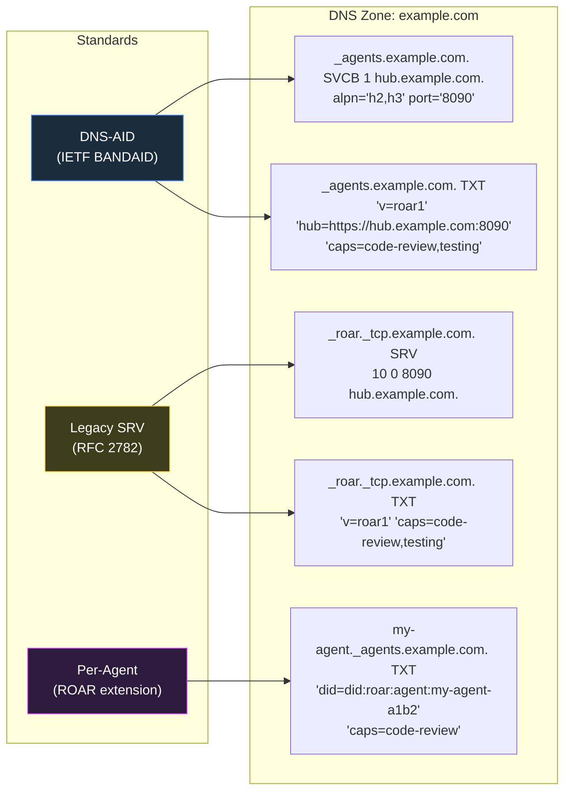
```mermaid
graph LR
  subgraph Zone["DNS Zone: example.com"]
    direction TB
    SVCB["_agents.example.com. SVCB 1 hub.example.com.<br/>alpn='h2,h3' port='8090'"]
    TXT1["_agents.example.com. TXT<br/>'v=roar1' 'hub=https://hub.example.com:8090'<br/>'caps=code-review,testing'"]
    SRV["_roar._tcp.example.com. SRV<br/>10 0 8090 hub.example.com."]
    TXT2["_roar._tcp.example.com. TXT<br/>'v=roar1' 'caps=code-review,testing'"]
    AGENT["my-agent._agents.example.com. TXT<br/>'did=did:roar:agent:my-agent-a1b2'<br/>'caps=code-review'"]
  end

  subgraph Standards["Standards"]
    AID["DNS-AID<br/>(IETF BANDAID)"]
    LEG["Legacy SRV<br/>(RFC 2782)"]
    PER["Per-Agent<br/>(ROAR extension)"]
  end

  AID --> SVCB
  AID --> TXT1
  LEG --> SRV
  LEG --> TXT2
  PER --> AGENT

  style AID fill:#1b2d3d,stroke:#448AFF,color:#fff
  style LEG fill:#3d3d1b,stroke:#FFD740,color:#fff
  style PER fill:#2d1b3d,stroke:#E040FB,color:#fff
```

---

## 11. Protocol Adapter Bridge

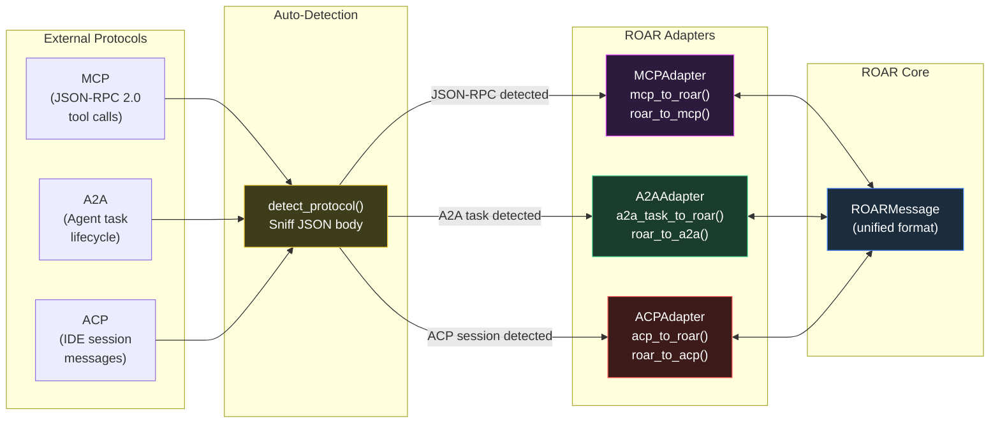
```mermaid
flowchart LR
  subgraph External["External Protocols"]
    MCP_IN["MCP<br/>(JSON-RPC 2.0<br/>tool calls)"]
    A2A_IN["A2A<br/>(Agent task<br/>lifecycle)"]
    ACP_IN["ACP<br/>(IDE session<br/>messages)"]
  end

  subgraph Detection["Auto-Detection"]
    DET["detect_protocol()<br/>Sniff JSON body"]
  end

  subgraph Adapters["ROAR Adapters"]
    MA["MCPAdapter<br/>mcp_to_roar()<br/>roar_to_mcp()"]
    AA["A2AAdapter<br/>a2a_task_to_roar()<br/>roar_to_a2a()"]
    CA["ACPAdapter<br/>acp_to_roar()<br/>roar_to_acp()"]
  end

  subgraph Core["ROAR Core"]
    RM["ROARMessage<br/>(unified format)"]
  end

  MCP_IN --> DET
  A2A_IN --> DET
  ACP_IN --> DET

  DET -->|"JSON-RPC detected"| MA
  DET -->|"A2A task detected"| AA
  DET -->|"ACP session detected"| CA

  MA <--> RM
  AA <--> RM
  CA <--> RM

  style DET fill:#3d3d1b,stroke:#FFD740,color:#fff
  style RM fill:#1b2d3d,stroke:#448AFF,color:#fff
  style MA fill:#2d1b3d,stroke:#E040FB,color:#fff
  style AA fill:#1b3d2d,stroke:#69F0AE,color:#fff
  style CA fill:#3d1b1b,stroke:#FF5252,color:#fff
```

---

## 12. Connection Lifecycle

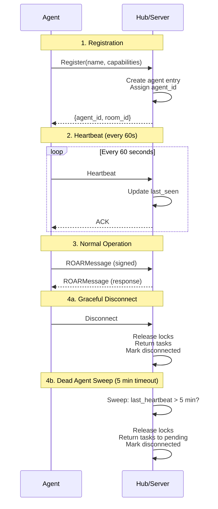
```mermaid
sequenceDiagram
  participant A as Agent
  participant H as Hub/Server

  Note over A,H: 1. Registration
  A->>H: Register(name, capabilities)
  H->>H: Create agent entry<br/>Assign agent_id
  H-->>A: {agent_id, room_id}

  Note over A,H: 2. Heartbeat (every 60s)
  loop Every 60 seconds
    A->>H: Heartbeat
    H->>H: Update last_seen
    H-->>A: ACK
  end

  Note over A,H: 3. Normal Operation
  A->>H: ROARMessage (signed)
  H-->>A: ROARMessage (response)

  Note over A,H: 4a. Graceful Disconnect
  A->>H: Disconnect
  H->>H: Release locks<br/>Return tasks<br/>Mark disconnected

  Note over A,H: 4b. Dead Agent Sweep (5 min timeout)
  H->>H: Sweep: last_heartbeat > 5 min?
  H->>H: Release locks<br/>Return tasks to pending<br/>Mark disconnected
```

---

## Quick Reference — ROARMessage Wire Format

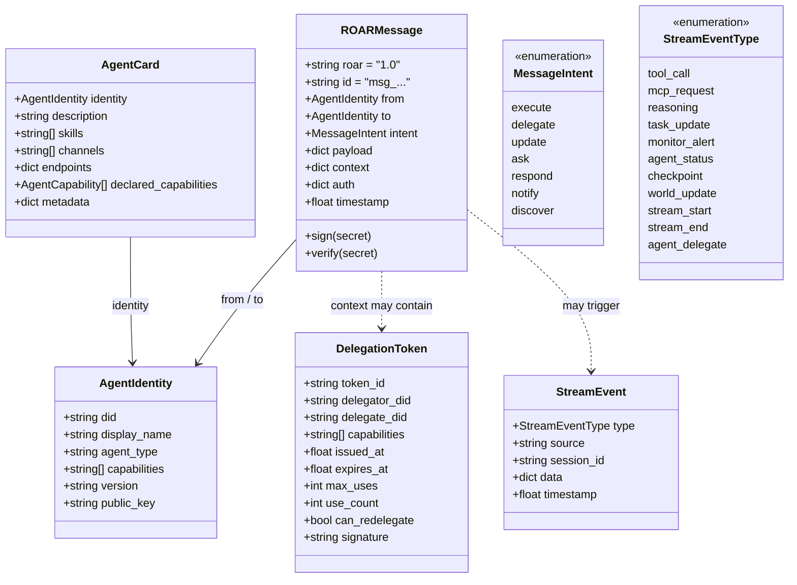
```mermaid
classDiagram
  class ROARMessage {
    +string roar = "1.0"
    +string id = "msg_..."
    +AgentIdentity from
    +AgentIdentity to
    +MessageIntent intent
    +dict payload
    +dict context
    +dict auth
    +float timestamp
    +sign(secret)
    +verify(secret)
  }

  class AgentIdentity {
    +string did
    +string display_name
    +string agent_type
    +string[] capabilities
    +string version
    +string public_key
  }

  class AgentCard {
    +AgentIdentity identity
    +string description
    +string[] skills
    +string[] channels
    +dict endpoints
    +AgentCapability[] declared_capabilities
    +dict metadata
  }

  class DelegationToken {
    +string token_id
    +string delegator_did
    +string delegate_did
    +string[] capabilities
    +float issued_at
    +float expires_at
    +int max_uses
    +int use_count
    +bool can_redelegate
    +string signature
  }

  class StreamEvent {
    +StreamEventType type
    +string source
    +string session_id
    +dict data
    +float timestamp
  }

  ROARMessage --> AgentIdentity : from / to
  AgentCard --> AgentIdentity : identity
  ROARMessage ..> DelegationToken : context may contain
  ROARMessage ..> StreamEvent : may trigger

  class MessageIntent {
    <<enumeration>>
    execute
    delegate
    update
    ask
    respond
    notify
    discover
  }

  class StreamEventType {
    <<enumeration>>
    tool_call
    mcp_request
    reasoning
    task_update
    monitor_alert
    agent_status
    checkpoint
    world_update
    stream_start
    stream_end
    agent_delegate
  }
```

---

## OSI Mapping

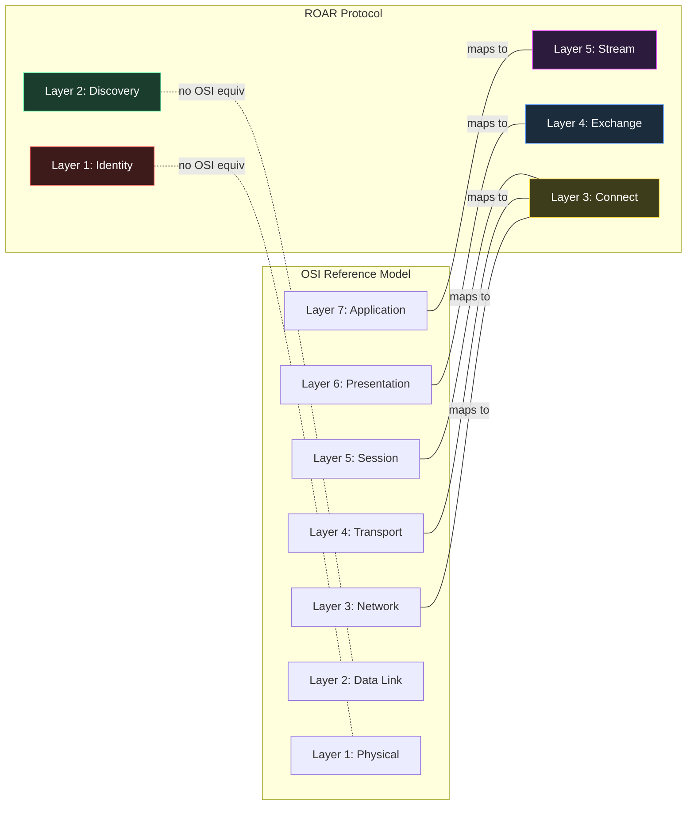
```mermaid
graph LR
  subgraph OSI["OSI Reference Model"]
    direction TB
    O7["Layer 7: Application"]
    O6["Layer 6: Presentation"]
    O5["Layer 5: Session"]
    O4["Layer 4: Transport"]
    O3["Layer 3: Network"]
    O2["Layer 2: Data Link"]
    O1["Layer 1: Physical"]
  end

  subgraph ROAR["ROAR Protocol"]
    direction TB
    R5["Layer 5: Stream"]
    R4["Layer 4: Exchange"]
    R3["Layer 3: Connect"]
    R2["Layer 2: Discovery"]
    R1["Layer 1: Identity"]
  end

  O7 ---|"maps to"| R5
  O6 ---|"maps to"| R4
  O5 ---|"maps to"| R3
  O4 ---|"maps to"| R3
  O3 ---|"maps to"| R3
  R2 -.-|"no OSI equiv"| O2
  R1 -.-|"no OSI equiv"| O1

  style R5 fill:#2d1b3d,stroke:#E040FB,color:#fff
  style R4 fill:#1b2d3d,stroke:#448AFF,color:#fff
  style R3 fill:#3d3d1b,stroke:#FFD740,color:#fff
  style R2 fill:#1b3d2d,stroke:#69F0AE,color:#fff
  style R1 fill:#3d1b1b,stroke:#FF5252,color:#fff
```

---

  Diagrams generated for ROAR Protocol v0.3.0 
  Render with any Mermaid-compatible viewer: GitHub, VS Code (Mermaid Preview), Obsidian, etc.

